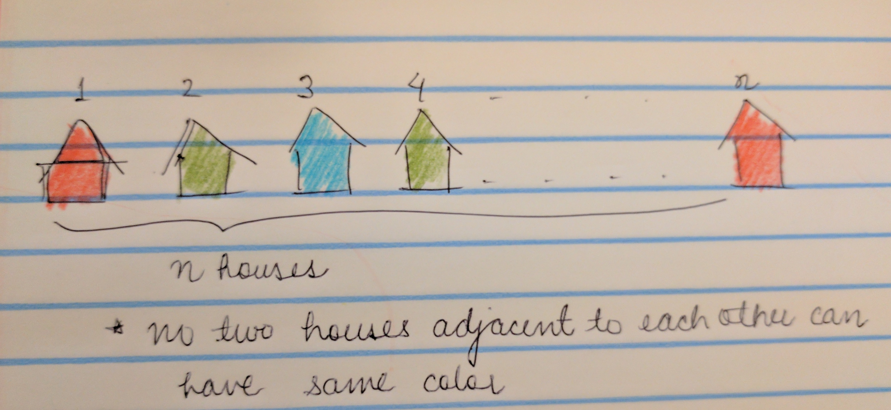
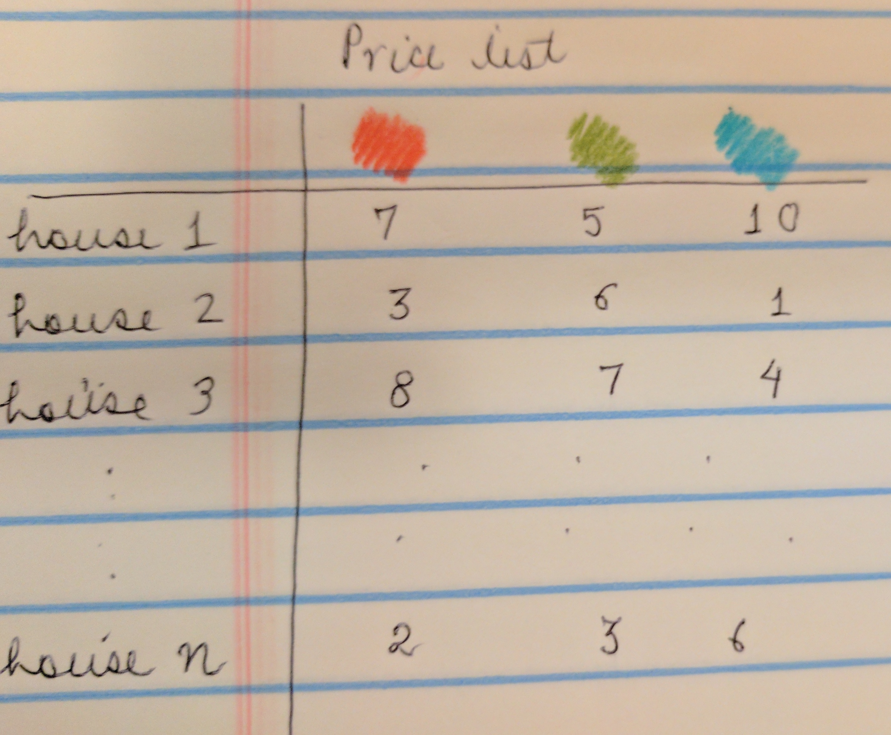
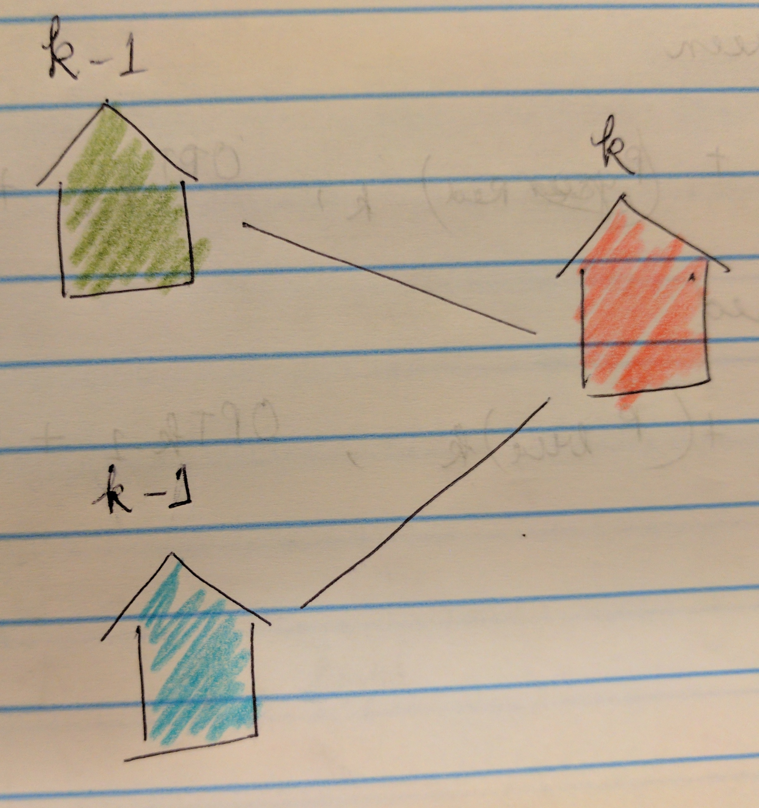

## Paint House

There are a row of n houses, each house can be painted with one of the three colors: red, blue or green. 
The cost of painting each house with a certain color is different.
You have to paint all the houses such that no two adjacent houses have the same color.
The cost of painting each house with a certain color is represented by a n x 3 cost matrix. 

For example, 
  costs[0][0] is the cost of painting house 0 with color red; 
  costs[1][2] is the cost of painting house 1 with color green, and so on... 

Find the minimum cost to paint all houses.

### Approach

Now, at first the problem seems wildly complicated, but actually its very simple.

Problem says - We have n houses, painted with one of the three colors: red, blue or green. We have to paint all the houses such that no two adjacent houses have the same color. Something like this maybe -

Cost matrix can be imagined to be something like this -

Lets take the kth house. Now we have only three options of colors. So, kth house can be either red or blue or green. Say, the house is red, then we know k-1 can be only blue or green.

Similarly, if kth house is blue or green, we know its previous house can be only of the two other choices. I think, we just framed a solution.

Let's denote,  Cost of painting k houses with min cost = OPT_COST(k)

    OPT_COST(k,red) = Red(k) + Min(OPT_COST(k-1,blue), OPT_COST(k-1,green))
    OPT_COST(k,blue) = Blue(k) + Min(OPT_COST(k-1,red), OPT_COST(k-1,green))
    OPT_COST(k,green) = Green(k) + Min(OPT_COST(k-1,blue), OPT_COST(k-1,red))
    
This is our recursive equation!!

### Implementation

[Java Implementation](https://github.com/hkasera/sturdy-spork/blob/master/dynamic_programming/code/PaintHouse.java)

